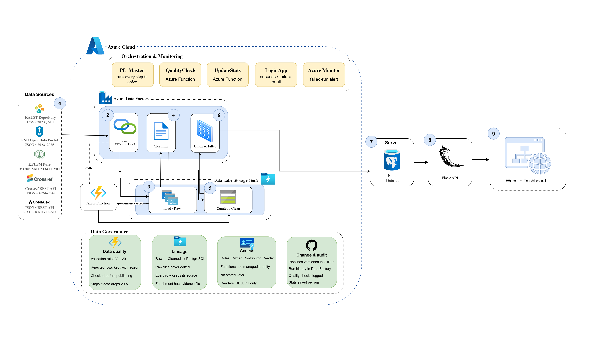

# Saudi Technology Research Data Hub — Azure implementation

This repository holds the cloud side of the project. Azure Data Factory collects research
metadata from six Saudi universities, cleans and validates it, and keeps the
technology-related papers. It then publishes one consolidated table in Azure Database for
PostgreSQL.

**Team:** Rana Ayman Almohethef · Rana Saad AlHasaniah · Aryam Saad Alotaibi

| Result (last full run) | Value |
|---|---|
| Rows in `research.final_dataset` | **5,341** technology papers |
| Universities | KSU 1,483 · KAU 1,400 · KKU 1,101 · PSAU 1,015 · KFUPM 211 · KAUST 131 |
| Validated records across all sources | 22,943 |
| Years covered | 2023–2026 |

---

## 1. Repository layout

```
adf/                    Azure Data Factory, synced through Git integration
  pipeline/             8 pipelines (PL_Master and its children)
  dataflow/             4 mapping data flows
  dataset/              21 datasets
  linkedService/        9 linked services (credentials are encrypted, not stored here)
  factory/              factory definition (saudi-tech-adf-rana)
azure_function/         Python Function App (saudi-tech-func-rana)
  function_app.py       5 HTTP functions
  processing.py         KFUPM / OpenAlex cleaning entry point
  main.py, src/         shared cleaning, validation and filtering code
  config.yaml           years, sources, technology keywords
  requirements.txt
```

---

## 2. Architecture

```
Sources (APIs / websites)
  -> Raw/                         ADLS Gen2, unchanged copies (CSV, JSON, XML)
  -> interim/cleaned/             cleaned + validated (CSV, Parquet)
     or research.publications     PostgreSQL (KAUST + Crossref)
  -> research.final_dataset_candidate   union + technology filter
  -> research.final_dataset             validated, then published
```

| Resource | Name |
|---|---|
| Data Factory | `saudi-tech-adf-rana` |
| Storage (ADLS Gen2) | `storageacc4saudi`, container `saudi-tech-research` |
| PostgreSQL flexible server | `saudi-tech-pg`, database `research_hub`, schema `research` |
| Function App (Python 3.11, Flex Consumption) | `saudi-tech-func-rana` |
| Logic App (email notifications) | `la-saudi-tech-notify` |
| Key Vault (Logic App URL) | `kv-saudi-tech-rana` |

---

## 3. Sources

| University | Source | Raw format | Cleaned in | Scope |
|---|---|---|---|---|
| KAUST 2023 | KAUST repository (DSpace) | CSV | Data flow | Year 2023 |
| KAUST 2024–2026 | Crossref API (ROR `01q3tbs38`) | JSON | Data flow | 2024–2026 |
| KSU | KSU open data portal | JSON | Data flow | 2023–2025 files |
| KFUPM | Pure OAI-PMH (MODS) | XML | Azure Function | Computer Engineering, 2023–2026 |
| KAU, KKU, PSAU | OpenAlex API | JSON | Azure Function | Computer Science field, 2023–2026, with DOI |

KFUPM and OpenAlex are cleaned in Python (Azure Functions) because nested MODS XML and
OpenAlex inverted-index abstracts cannot be handled in mapping data flows.

---

## 4. Pipelines

### PL_Master (parent)

Runs everything in order. Each activity starts only when the previous one succeeds.

| # | Activity | Type | Runs |
|---|---|---|---|
| 0 | `GetEmailUrl` | Web (managed identity) | reads the Logic App URL from Key Vault (secure output) |
| 1 | `RunKaust` | Execute Pipeline | `KAUST_Clean_Pipeline` |
| 2 | `RunCrossref` | Execute Pipeline | `PL_Ingest_Crossref` |
| 3 | `RunKsu` | Execute Pipeline | `PL_Ingest_KSU` (years 2023–2025) |
| 4 | `RunKfupm` | Execute Pipeline | `PL_Ingest_KFUPM` (years 2023–2026) |
| 5 | `RunOpenAlex` | Execute Pipeline | `PL_Ingest_OpenAlex` (3 RORs) |
| 6 | `RunFinal` | Execute Pipeline | `PL_Final_Union` |
| 7 | `QualityCheck` | Azure Function | `quality_check` |
| 8 | `UpdateStats` | Azure Function | `update_stats` |
| 9 | `EmailSuccess` | Web | Logic App, on UpdateStats success |
| 10 | `EmailFailure` | Web | Logic App, on UpdateStats failure **or skip** |
| 11 | `FailPipeline` | Fail | keeps the run marked Failed after the failure email |

Array parameters are passed with `@createArray(...)`.

### Child pipelines

| Pipeline | Activities | Writes to |
|---|---|---|
| `KAUST_Clean_Pipeline` | `GetBundles → GetBitstreams → DownloadCsv` (deactivated) `→ KAUST_2023_Clean_DF → MergeToFinal` | `interim/cleaned/kaust_2023/`, `research.publications` |
| `PL_Ingest_Crossref` | `FetchCrossref (cursor paging) → CleanCrossref → MergeToFinal` | `Raw/kaust/crossref/`, `research.publications` |
| `PL_Ingest_KSU` | `ForEachYear → CopyKsuYear → RunKsuClean (KSU_Clean_DF)` | `Raw/ksu/`, `interim/cleaned/ksu/{year}/` (Parquet) |
| `PL_Ingest_KFUPM` | `ForEachYear → PL_Harvest_KFUPM_Year`, then `ProcessKfupm` | `Raw/kfupm/`, `interim/cleaned/kfupm/` |
| `PL_Harvest_KFUPM_Year` | `SetFirstUrl → Until [GetPage → SavePage → SetToken → IfMore]` | `Raw/kfupm/year{Y}_page{NNNN}.xml` |
| `PL_Ingest_OpenAlex` | `ForEachUniversity → CopyOpenAlex`, then `ProcessOpenAlex` | `Raw/openalex/`, `interim/cleaned/openalex/` |
| `PL_Final_Union` | `RunFinalUnion (Final_Union_DF) → ValidateCandidate → PublishFinal` | `research.final_dataset_candidate`, `research.final_dataset` |

The KAUST repository blocks requests from Azure IP ranges, so its 2023 CSV was staged once in
`Raw/kaust/` by hand. It is a closed-year archive and does not change.

### Data flows

| Data flow | Main steps |
|---|---|
| `KAUST_2023_Clean_DF` | trim/null markers → parse 4 date formats → keep 2023 → rank duplicates, keep most complete → schema + types → CSV sink and PostgreSQL staging |
| `Crossref_Clean_DF` | flatten `message.items` → authors, abstract (HTML stripped), year/date → validate → metrics → staging |
| `KSU_Clean_DF` | row index → clean fields → join manual enrichment → apply enrichment (fills missing DOI/abstract only) → validate → Parquet |
| `Final_Union_DF` | 4 sources → align types → union by name → recompute metrics → technology filter (33 whole-word terms) → candidate table |

---

## 5. Quality gates

**Before publishing — `ValidateCandidate` (SQL, stops the run on the first failure):**

1. Candidate table is not empty
2. The 8 required fields are filled (missing markers such as `n/a`, `null` count as empty)
3. University is one of the six
4. All six universities are present
5. Year is an integer from 2023 to 2026
6. DOI matches `^10\.[0-9]{4,9}/\S+$`
7. URL is a valid http(s) URL without spaces
8. `publication_date` year equals `publication_year`
9. No duplicate `research_id`
10. No duplicate DOI within one university
11. No university dropped by more than 20% compared with the current published table

`PublishFinal` then replaces `research.final_dataset` inside one transaction, so a failure
leaves the published table unchanged.

**After publishing — `quality_check` (Azure Function):** re-checks the published table and
stores every result in `research.quality_checks`. It also compares the total with the last
passed check.

---

## 6. Azure Functions

| Function | Route | Called by | Reads | Writes |
|---|---|---|---|---|
| `process_kfupm` | POST `/api/process/kfupm` | `ProcessKfupm` | `Raw/kfupm/*.xml` | `interim/cleaned/kfupm/`, `interim/rejected/kfupm/` |
| `process_openalex` | POST `/api/process/openalex` | `ProcessOpenAlex` | `Raw/openalex/*.json` | `interim/cleaned/openalex/`, `interim/rejected/openalex/` |
| `quality_check` | POST `/api/quality_check` | `QualityCheck` | `research.final_dataset` | `research.quality_checks` |
| `update_stats` | POST `/api/update_stats` | `UpdateStats` | cleaned files, `research.publications` | `research.source_stats` |
| `health` | GET `/api/health` | manual | `Raw/` | — |

App settings: `STORAGE_ACCOUNT_URL`, `DATA_CONTAINER`, `PGHOST`, `PGDATABASE`, `PGUSER`,
`PGPASSWORD`. The app's managed identity has **Storage Blob Data Contributor** on the
storage account.

Deploy (the zip must have `host.json` at its root):

```bash
cd azure_function
zip -r ../saudi_tech_function.zip .
az functionapp deployment source config-zip -g saudi-tech-demo -n saudi-tech-func-rana \
  --src ../saudi_tech_function.zip --build-remote true
```

---

## 7. Final table schema

`research.final_dataset`. The first 13 columns are the shared schema used by every source.

| Column | Type | Required |
|---|---|---|
| `research_id` | text (primary key) | yes |
| `university` | text | yes |
| `title` | text | yes |
| `authors` | text (`; ` separated) | yes |
| `publication_year` | integer | yes |
| `publication_date` | date (only when the full date is known) | no |
| `abstract` | text | no |
| `research_field` | text | no |
| `tech_category` | text | no |
| `journal` | text | no |
| `doi` | text (lowercase) | yes |
| `url` | text | yes |
| `source` | text | yes |
| `has_doi` | boolean | derived |
| `abstract_word_count` | integer | derived |
| `loaded_at` | timestamptz | default |

A paper co-authored by two included universities appears once per university. Count unique
papers with `COUNT(DISTINCT doi)`.

---

## 8. Notifications and security

- **Run emails:** `EmailSuccess` / `EmailFailure` post `{status, pipeline, runId, message}` to
  the Logic App, which sends a Gmail message. The success email includes the row count and
  the validated total.
- **Alert:** the Azure Monitor rule `adf-pipeline-failed` fires when failed pipeline runs > 0.
  Debug runs are not counted.
- **Secrets:** the Logic App callback URL is stored in Key Vault as `logicapp-url` and read at
  run time by `GetEmailUrl` (managed identity, **Key Vault Secrets User**; secure input and
  output on). Linked-service credentials are encrypted by Data Factory. No password or key is
  stored in this repository.

---

## 9. Running

1. Open Data Factory Studio and publish all changes (`Trigger now` runs the **published** version).
2. Trigger `PL_Master`. A full run takes about one hour; KFUPM harvesting is the longest step.
3. Check the email or Monitor → Pipeline runs.
4. Verify in PostgreSQL:

```sql
SELECT university, COUNT(*) FROM research.final_dataset GROUP BY 1 ORDER BY 1;
SELECT * FROM research.quality_checks ORDER BY checked_at DESC LIMIT 1;
```

For a quick test, set the `Run*` activities to Inactive (marked Succeeded) and run Debug. The
checks and emails then run on the last published data.

---

## 10. Known limitations

| Item | Note |
|---|---|
| KAUST 2023 file | Staged manually once (repository blocks Azure IPs). |
| KSU `research_id` | Built from the row position in each yearly file (`KSU_{year}_{row}`) to match the Python pipeline. It changes if KSU reorders a file. |
| `research.publications` | Upsert only. Records removed upstream by Crossref are not deleted. |
| Rejected rows | Saved with reasons for KFUPM and OpenAlex (Functions); the data flows filter them without a rejected file. |
| Python vs Azure counts | Azure uses newer API snapshots (for example Crossref 205 vs 124 records), so counts can differ slightly from the local Python run. |
| KFUPM raw pages | Pages are overwritten by name; old extra pages are not deleted if a later harvest returns fewer pages. |
| Function timeouts | Each process call runs within one HTTP request (Data Factory waits up to ~230 s); current runs finish in under a minute. |
| OpenAlex | Live source; counts can grow between runs. |


## Architecture




